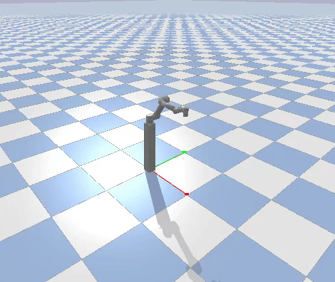
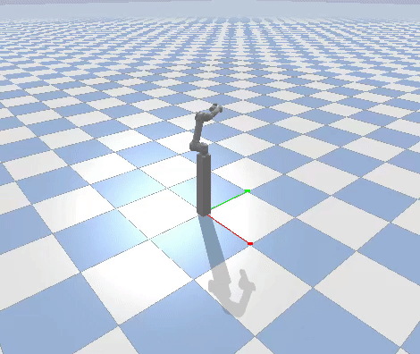
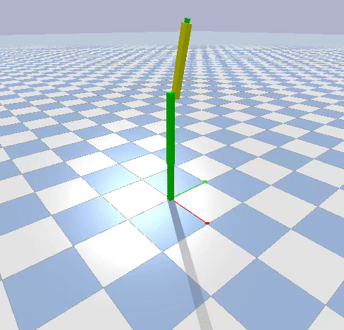
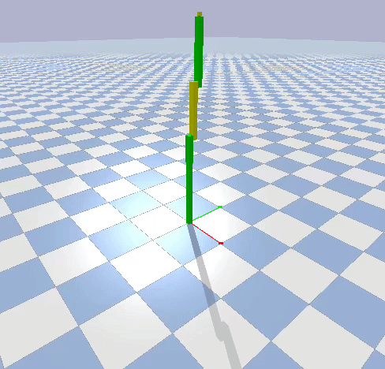
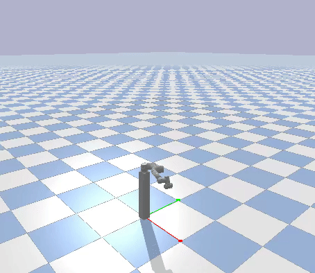
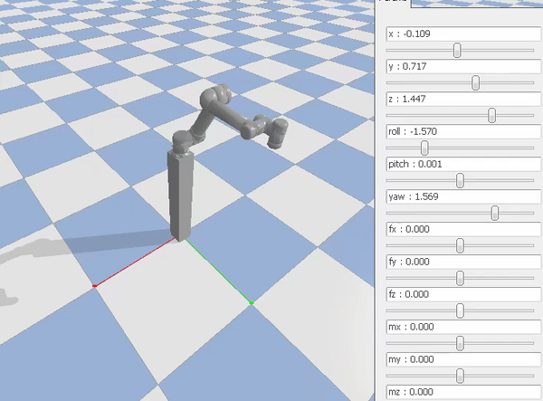

# Kinematics, dynamics and control of robotic systems in Pybullet
This repository will help in kinematic and dynamic analysis of robotic systems. Some of the examples for solving forward and inverse position and velocity kinematics, forward and inverse dynamics simulations have been kept in the [examples](https://github.com/deepakraina99/pybullet-kinematics-dynamics-control/tree/master/examples) folder. User can take their help to simulate different robotic systems. In addition, it has capability to incorporate any control algorithm and trajectory planner with utmost ease. Computed torque control and impedence control has been implemented as an example.

## How to run the code ?
To make the program easy to use, ```RobotController``` class has been written to perform all kind of simulations. The class has folllowing inputs:

**1.** _robot_type_: specify urdf file initials eg. if urdf file name is 'ur5.urdf', specify 'ur5'

**2.** _controllable_joints_: joint indices of controllable joints. If not specified, by default all joints indices except first joint (first joint is fixed joint between robot stand and base) 

**3.** _end-eff_index_: specify the joint indices for end-effector link. If not specified, by default the last controllable_joints is considered as end-effector joint

**4.** _time_Step_: time step for simulation

The example for doing inverse dynamic simulation using this class is shown below:
```
robot = RobotController(robot_type='ur5')
robot.createWorld(GUI=True)

# Inverse dynamic simulation
# Input: numpy array of joint angles
thi = np.array([0, 0, 0, 0, 0, 0]) # initial joint angles
thf = np.array([-1.5, -1.0, 1.0, -1.57, -1.57, -1.57]) # final joint nagles
robot.setJointPosition(thi)
robot.doInverseDynamics(thi, thf)
```


### Tested on various robotic systems
1-link, 2-link, 3-link robots with rotary joints, Universal Robots UR5

### Joint and task space velocity control
 
 

### Free-fall under gravity simulation
  
 
 
 

### Inverse Dynamics Simuilation
  

### Computed Torque Control
  

### Impedence Control
  

The details regarding the various control techniques and their implementation in pybullet is availabe in [appendix](https://github.com/deepakraina99/pybullet-kinematics-dynamics-control/tree/master/docs)
